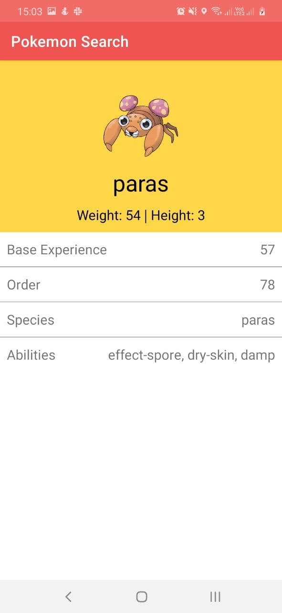
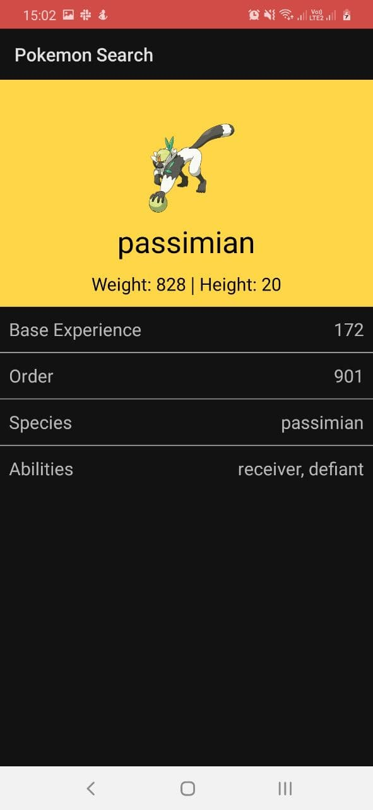

## Pokemon Search

A very simple android app that fetches the full list of pokemons from the pokeapi.co, and searches through it using the name of the pokemon.

The user can enter a search string in the text box, and get a list of pokemons whose names begin with that search string.

## Screenshots

### Light

 

### Dark

 
